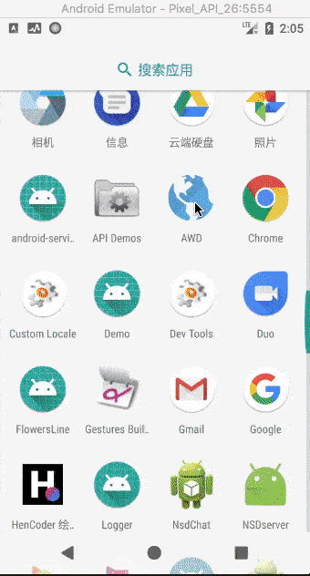
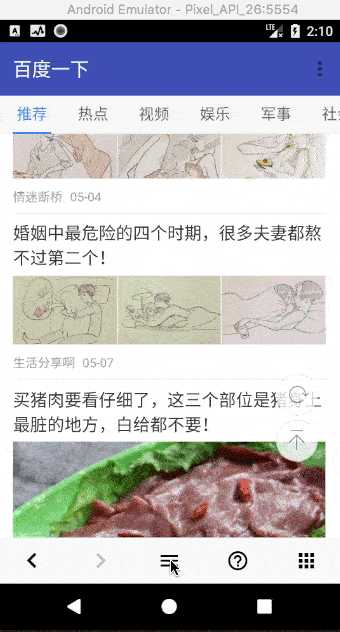
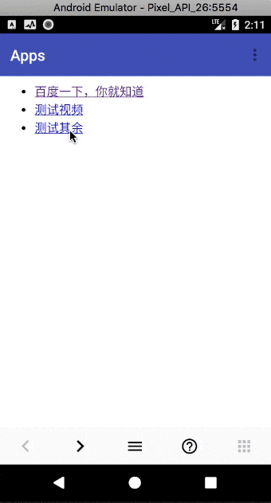

# android-webview-demo

a demo which demonstrates the basic usage of Android WebView.

通过实现一个简单的浏览器来演示 WebView 的基本用法。

## 截图

| 网页、前进、后退 | 刷新、上一页、下一页、滚到顶部、滚到底部 | 查找网页内容 | 其它 
| - | - | - | -
|  |  |  | 

